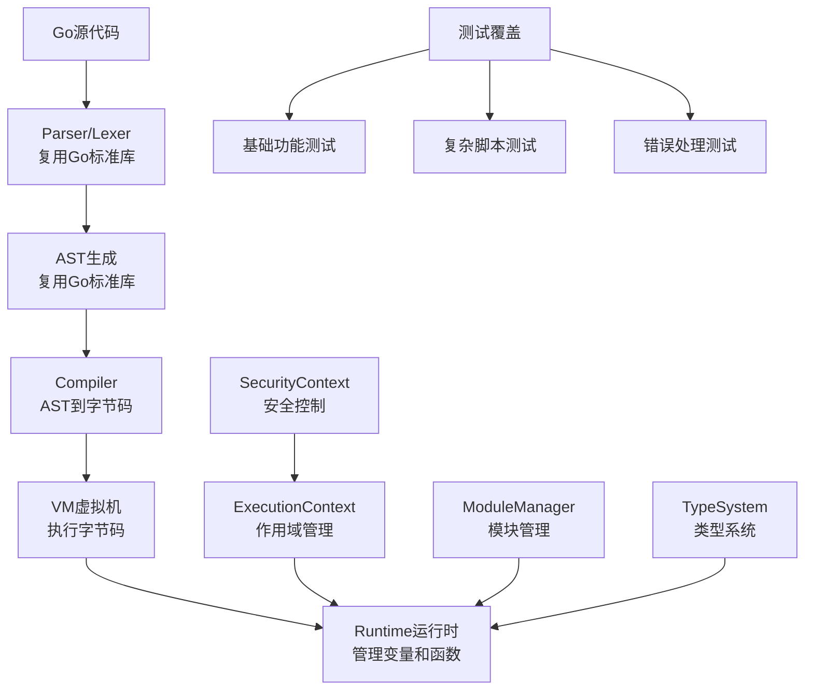

# GoScript项目架构分析报告

## 项目概述

GoScript是一个兼容Go标准语法的脚本引擎，旨在提供安全、高效的动态代码执行环境。项目采用了模块化设计，包含词法分析、语法分析、AST生成、编译器、虚拟机和运行时等核心组件。

## 架构流程图



## 主要问题和不足

### 1. 架构设计问题

#### 问题1：过度依赖Go标准库
- **现状**：Parser和Lexer完全依赖Go标准库的`go/parser`和`go/scanner`
- **问题**：无法实现真正的脚本化执行，因为Go标准库要求完整的包结构
- **影响**：限制了脚本的灵活性和独立性

#### 问题2：VM设计过于复杂
- **现状**：VM包含大量操作码（OpCode），每个操作都需要特殊处理
- **问题**：代码冗余，维护困难，性能不佳
- **影响**：增加了系统复杂度和出错概率

#### 问题3：类型系统不完整
- **现状**：类型系统设计简单，缺乏完整的类型检查
- **问题**：无法提供编译时类型安全
- **影响**：运行时错误多，调试困难

### 2. 代码质量问题

#### 问题4：错误处理不一致
- **现状**：错误处理方式不统一，有些地方返回error，有些地方panic
- **问题**：难以进行有效的错误恢复和调试
- **影响**：系统稳定性差

#### 问题5：代码重复严重
- **现状**：VM中的操作码处理逻辑大量重复
- **问题**：维护成本高，容易引入bug
- **影响**：代码可读性和可维护性差

#### 问题6：缺乏适当的抽象
- **现状**：各组件之间耦合度高，缺乏清晰的接口定义
- **问题**：难以进行单元测试和模块替换
- **影响**：系统扩展性差

### 3. 性能问题

#### 问题7：执行效率低
- **现状**：VM采用解释执行，每次操作都需要类型检查
- **问题**：性能远低于原生Go代码
- **影响**：不适合性能敏感的应用场景

#### 问题8：内存使用效率低
- **现状**：大量使用interface{}和map[string]interface{}
- **问题**：内存分配频繁，GC压力大
- **影响**：内存使用效率低

### 4. 测试覆盖问题

#### 问题9：测试覆盖不全面
- **现状**：测试主要集中在基础功能，缺乏边界条件和错误场景测试
- **问题**：无法保证代码质量
- **影响**：生产环境稳定性差

#### 问题10：缺乏性能测试
- **现状**：没有性能基准测试
- **问题**：无法评估性能改进效果
- **影响**：性能优化缺乏依据

### 5. 文档和可维护性问题

#### 问题11：文档不完整
- **现状**：API文档和架构文档不够详细
- **问题**：新开发者难以理解和使用
- **影响**：项目可维护性差

#### 问题12：缺乏设计模式
- **现状**：代码结构混乱，缺乏统一的设计模式
- **问题**：代码难以理解和扩展
- **影响**：开发效率低

## 改进建议

### 1. 架构重构建议

#### 建议1：重新设计Parser
- 实现独立的词法和语法分析器
- 支持真正的脚本语法，不依赖Go包结构
- 提供更好的错误报告和恢复机制

#### 建议2：简化VM设计
- 减少操作码数量，采用更简单的指令集
- 实现JIT编译优化
- 提供更好的调试支持

#### 建议3：完善类型系统
- 实现完整的类型检查
- 支持泛型和接口
- 提供类型安全的运行时

### 2. 代码质量改进

#### 建议4：统一错误处理
- 建立统一的错误处理机制
- 提供详细的错误信息和堆栈跟踪
- 实现错误恢复机制

#### 建议5：减少代码重复
- 提取公共操作逻辑
- 使用模板和代码生成
- 建立代码审查机制

#### 建议6：提高抽象层次
- 定义清晰的接口
- 实现依赖注入
- 支持插件化扩展

### 3. 性能优化

#### 建议7：实现JIT编译
- 将热点代码编译为原生机器码
- 实现类型特化优化
- 提供性能分析工具

#### 建议8：优化内存使用
- 使用对象池减少分配
- 实现更高效的数据结构
- 优化GC性能

### 4. 测试改进

#### 建议9：完善测试覆盖
- 增加边界条件测试
- 实现压力测试
- 建立持续集成

#### 建议10：性能测试
- 建立性能基准
- 实现性能回归测试
- 提供性能分析工具

## 具体代码问题示例

### VM操作码处理重复代码

在`vm/opcodes.go`中，存在大量重复的操作码处理逻辑：

```go
// 重复的栈检查逻辑
if len(vm.stack) < 2 {
    return nil, fmt.Errorf("stack underflow in BINARY_OP: expected 2 values, got %d", len(vm.stack))
}

// 重复的参数类型转换
var indexInt int
if i, ok := index.(int); ok {
    indexInt = i
} else {
    return nil, fmt.Errorf("index must be an integer, got %T", index)
}
```

### 错误处理不一致

```go
// 有些地方返回error
func (vm *VM) executeFunction(name string, args ...interface{}) (interface{}, error) {
    // ...
    return nil, fmt.Errorf("undefined function: %s", name)
}

// 有些地方直接panic
func (vm *VM) Pop() interface{} {
    if len(vm.stack) == 0 {
        return nil  // 应该返回error而不是nil
    }
    // ...
}
```

### 类型系统过于简单

```go
// 类型检查过于简单
func (bt *BaseType) Equals(other IType) bool {
    if other == nil {
        return false
    }
    return bt.name == other.TypeName()  // 只比较名称，没有深度类型检查
}
```

## 优先级建议

### 高优先级（立即处理）
1. 统一错误处理机制
2. 减少VM代码重复
3. 完善测试覆盖

### 中优先级（短期规划）
1. 重新设计Parser
2. 简化VM设计
3. 优化内存使用

### 低优先级（长期规划）
1. 实现JIT编译
2. 完善类型系统
3. 建立性能基准

## 总结

GoScript项目在架构设计上存在多个问题，主要集中在过度依赖Go标准库、VM设计复杂、类型系统不完整等方面。这些问题严重影响了项目的性能、可维护性和扩展性。

建议优先解决架构设计问题，重新设计Parser和VM，完善类型系统，并建立完善的测试和文档体系。通过这些改进，可以显著提升项目的质量和可用性。

---

*本报告基于对GoScript项目代码的深入分析，包括核心组件实现、测试覆盖、错误处理机制等方面的评估。*
